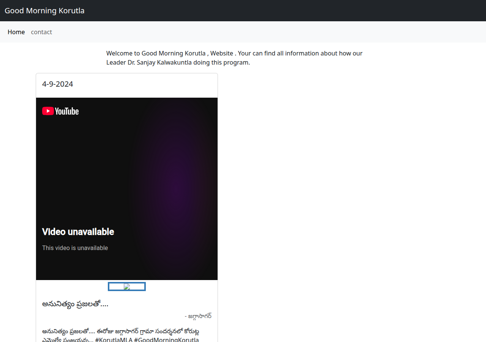
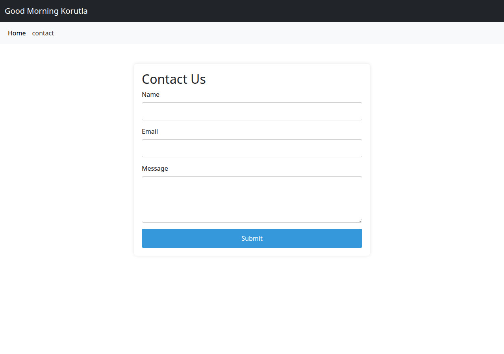

# Good Morning Korutla

A React site for the Good Morning Korutla program. The home page lists posts. A second page is a contact form with name, email, and message fields.

## Run it locally

Install dependencies, then start the dev server:

```bash
npm install
npm start
```

Open [http://localhost:3000](http://localhost:3000).

## Deployment

GitHub Pages is already enabled. The published site comes from the `gh-pages` branch:

https://nareshnalla.github.io/goodmorningkorutla/

`package.json` sets that address as `homepage`. `npm run deploy` builds the app and publishes the `build` folder with the `gh-pages` package.

That published copy is an older build. Opening the GitHub Pages URL shows the header and the Home and contact links, without the post list. Use `npm start` to see the current home page and contact page. The screenshots below are from that local run.

## Data

Posts on the home page are read from the existing Firebase project. The web configuration is already in `src/firebase.js`.

## Screens

Home:



Contact:


